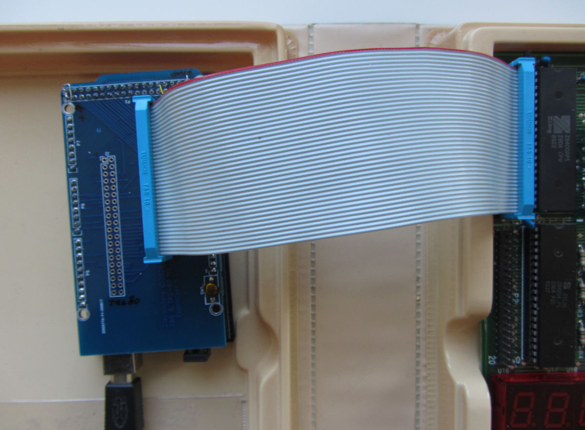

Z80BusAccess with an Arduino

Based on features from my earlier projects the [ROMEmu](https://github.com/electrickery/ROM-emulator) and the [Z80Exersizer](https://www.electrickery.nl/digaud/arduino/Z80exer/), this is a way to access memory and I/O from
a working Z80 CPU based computer. It uses a simple DMA technique by applying the BUSREQ* signal (and wait for BUSACK*).
Then the bus is tri-stated, allowing the BusAccess board to read and write all memory and I/O addresses. When BUSREQ* is cleared, the CPU continues where it was. The most interesting use-case is getting programs into the target system, but all memory and I/O operations can be executed, only not at original speed and timing.

For systems with non-critical timing constraints, the CPU doesn't even have to be reset, as long as you don't modify the code being executed. For the first testing system, a [MicroProfessor MPF-IB](https://en.wikipedia.org/wiki/Microprofessor) provides an easy way to get programs (side-load?) into memory using the well-known hex-intel file format. All the board monitor needs to have is a way to execute the new code. For the MPF this is for example: [ADDR] 2 0 0 0 [GO].

The current hardware is an Arduino Mega 2650 plus shield. The shield is passive, bringing 37 I/O-pins to a Z80 CPU bus:

		// Port A 22 - 29
		#define Z80A0  22 // A0
		#define Z80A1  23
		#define Z80A2  24
		#define Z80A3  25
		#define Z80A4  26
		#define Z80A5  27
		#define Z80A6  28
		#define Z80A7  29 // A7
		
		// Port C 37 - 30
		#define Z80A8  37 // A8
		#define Z80A9  36 // A9
		#define Z80A10 35 // AA
		#define Z80A11 34
		#define Z80A12 33
		#define Z80A13 32 // 
		#define Z80A14 31 // AE
		#define Z80A15 30 // AF
		
		// Port L 49 - 42
		#define Z80D0  49 // D0
		#define Z80D1  48
		#define Z80D2  47
		#define Z80D3  46
		#define Z80D4  45
		#define Z80D5  44
		#define Z80D6  43
		#define Z80D7  42 
		
		// Port K A8 - A15
		#define Z80WR    62 // A8  - WR
		#define Z80RD    63 // A9  - RD
		#define Z80MREQ  64 // A10 - MQ
		#define Z80IORQ  65 // A11 - IQ
		#define Z80M1    66 // A12 - M1
		#define Z80RFSH  67 // A13 - RF
		#define Z80HALT  68 // A14 - HT 
		#define Z80BUSAK 69 // A15 - BK
		
		// Port F A3 - A7
		#define Z80INT   57 // A3 // IN
		#define Z80NMI   58 // A4 // NM
		#define Z80WAIT  59 // A5 // WT
		#define Z80BUSRQ 60 // A6 // BQ
		#define Z80RESET 61 // A7 // RT
		
My (quite imperfect first) version of the board looks like this:

The TRS80 connector on the shield is used in exer-mode for a TRS-80 model 1 expansion connector. 
For bus access mode it is currently not supported.

A more compact version, based on a more compact Arduino-type microcontroller and a port extender is planned.
